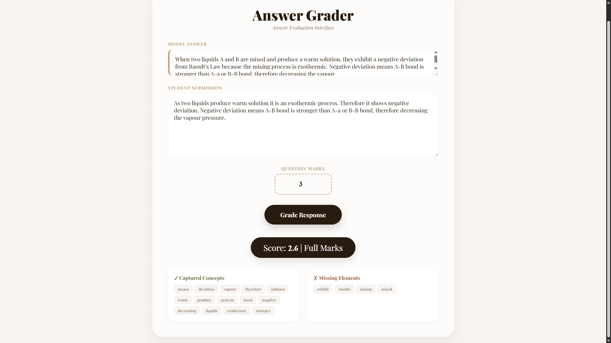

# Lightweight Automated Short Answer Grading using Semantic Similarity

> A research project developed during an internship at the **Department of Computer Science and Engineering, IIT Kharagpur** under the supervision of **Prof. Niloy Ganguly**.

---

## Overview

This project presents a lightweight Automated Short Answer Grading (ASAG) system designed specifically for **CBSE-style short descriptive answers**. The system evaluates student responses against a teacher's model answer using a hybrid approach combining **semantic similarity** and **keyword-based concept coverage**.

Unlike simple keyword matching systems, this project captures the *meaning* of an answer — correctly grading students who paraphrase even when they use different words.

A **TF-IDF baseline** is included for comparison, and the system is evaluated using **Mean Absolute Error (MAE)** and **Pearson Correlation** against real teacher-assigned scores.

---

## Research Paper

**Das, A. (2026). Lightweight Automated Short Answer Grading using Semantic Similarity. IIT Kharagpur CS Department Internship Research Report.**

> arXiv preprint link will be added upon publication.

---

## Problem Statement

- Manual grading of short answers is time-consuming, inconsistent, and difficult to scale in Indian classrooms where student-teacher ratios exceed 30:1 (UDISE+ 2022).
- Most existing ASAG systems are trained on Western university-level datasets and are computationally expensive.
- There is a significant gap in automated grading tools designed for **CBSE-style factual short answers**.

---

## How It Works

### 1. Text Preprocessing
Both student and model answers are cleaned using:
- Lowercase conversion
- Punctuation removal
- Stopword removal (NLTK)

### 2. Semantic Similarity
The cleaned answers are encoded into dense vector embeddings using **SBERT (all-MiniLM-L6-v2)**. Cosine similarity measures how semantically close the student answer is to the model answer — capturing correct answers even when phrased differently.

### 3. Keyword-Based Concept Coverage
Keywords are extracted from the model answer with length-based weighting:
- Words ≥ 8 characters → weight 2 (domain-specific terminology)
- Words ≥ 4 characters → weight 1

The concept ratio measures the weighted proportion of model keywords present in the student answer.

### 4. Final Scoring

```
Final Score = 0.5 × Semantic Similarity + 0.5 × Concept Coverage
```

This score is scaled to the question's maximum marks and mapped to a grade label.

---

## Results

Evaluated on **150 annotated CBSE answer pairs** across four subjects: Chemistry, Physics, Biology and English.

| Method | MAE | Pearson |
|--------|-----|---------|
| TF-IDF Baseline | 0.87 | — |
| **Proposed System (SBERT + Concept Coverage)** | **0.66** | **0.53** |

The proposed system reduces MAE by **24%** compared to the TF-IDF baseline, with a Pearson correlation of 0.53 against human teacher scores.

---

## Web Application

The system is deployed as a **FastAPI web application** with an interactive frontend. Teachers can input a model answer and student response, and receive:
- A predicted score scaled to question marks
- A grade label (Full Marks / Partial Marks / Needs Improvement)
- Matched and missing concept keywords for explainable feedback



---

## Tech Stack

| Layer | Tools |
|-------|-------|
| Backend | FastAPI, Uvicorn |
| NLP | Sentence Transformers, scikit-learn, NLTK, SciPy |
| Data | pandas |
| Frontend | HTML, CSS, JavaScript |

---

## Project Structure

```
Short-Descriptive-Answer-Grading/
│
├── app/
│   ├── __init__.py
│   ├── similarity.py        ← SBERT cosine similarity
│   ├── preprocessor.py      ← Text cleaning pipeline
│   └── grader.py            ← Keyword scoring + grade mapping
│
├── main.py                  ← FastAPI server
├── baseline.py              ← TF-IDF baseline evaluation
├── evaluate.py              ← Full system evaluation (MAE, Pearson)
├── evaluation_data.csv      ← 150-sample annotated dataset
├── index.html               ← Web UI
├── requirements.txt
├── .gitignore
└── README.md
```

---

## Installation

```bash
git clone https://github.com/AishikDas500/Short-Descriptive-Answer-Grading.git
cd Short-Descriptive-Answer-Grading
python -m venv venv
venv\Scripts\activate        # Windows
pip install -r requirements.txt
```

## Running the App

```bash
uvicorn main:app --reload
```

Open `http://127.0.0.1:8000` in your browser.

## Running Evaluation

```bash
# Full system evaluation
python evaluate.py

# TF-IDF baseline
python baseline.py
```

---

## Limitations

- Dataset limited to 150 samples across four subjects
- Keyword matching penalises correct paraphrasing
- English language only — no Hindi or regional language support
- Grading thresholds set empirically

---

## Future Work

- Synonym expansion using WordNet
- Fine-tuning on a larger CBSE-specific corpus
- Multilingual support (Hindi, Bengali)
- Subject-specific grading rubrics
- Teacher dashboard for bulk evaluation

---

## Acknowledgements

Developed under the supervision of **Prof. Niloy Ganguly**, Department of Computer Science and Engineering, IIT Kharagpur.

Thanks to **Debashrita Dey** and **Amrutanka Dey** for assistance in data collection.

---

## Author

**Aishik Das**  
Class 12 Student | Research Intern, IIT Kharagpur CS Department (2026)  
GitHub: [@AishikDas500](https://github.com/AishikDas500)

---

## License

Developed for academic and research purposes only. Not licensed for commercial use without prior permission from the author.
